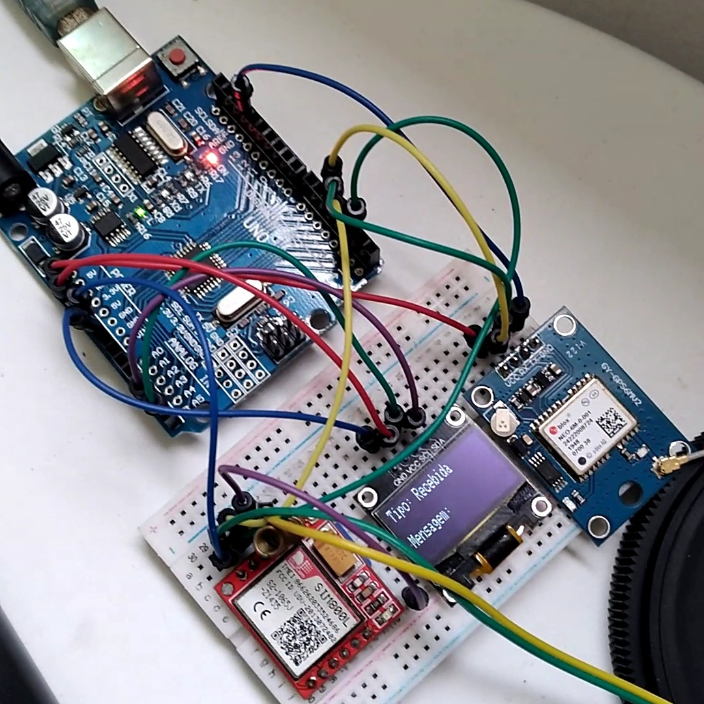

# GSM Tracker

This project is a GPS-based tracking system that utilizes the SIM800L GSM module to send and receive SMS messages containing the device's current location. The location is also displayed on an OLED screen for local viewing.

## Features

- Retrieves GPS coordinates using the GY-NEO6M module.
- Sends GPS coordinates as SMS messages in response to specific SMS commands (`gps1234`).
- Displays the GPS coordinates on an OLED screen.
- Configurable destination phone number for SMS responses.

## Getting Started

### Prerequisites

- **Hardware Components:**
  - Arduino (e.g., Arduino Uno or compatible board)
  - SIM800L GSM module
  - GY-NEO6M GPS module
  - OLED display (SSD1306, I2C)
  - Jump wires and a power supply (e.g., LiPo battery or regulated 5V supply)

- **Libraries:**
  - `Adafruit_GFX` for OLED graphics
  - `Adafruit_SSD1306` for OLED display
  - `TinyGPS++` for GPS decoding
  - `SoftwareSerial` for serial communication with modules

### Circuit Diagram



### Installation

1. Clone this repository:
   ```bash
   git clone https://github.com/vitorshaft/gsmTracker.git
2. Open the project in the Arduino IDE.

3. Install the required libraries using the Arduino Library Manager.

4. Configure your destination phone number:

- Replace the placeholder phone number in the sendGPSSMS() function with your destination number.
5. Upload the code to your Arduino board.

### Usage
1. Power on the device and wait for it to initialize.
2. Send an SMS with the text gps1234 to the GSM module.
3. The device will respond with its current GPS location in degrees and minutes.

### Notes
- Ensure the SIM card in the SIM800L module has sufficient balance and SMS permissions.
- The GPS module requires open skies for accurate location tracking.
- The OLED display will show the current coordinates, or it will indicate if the GPS data is unavailable.